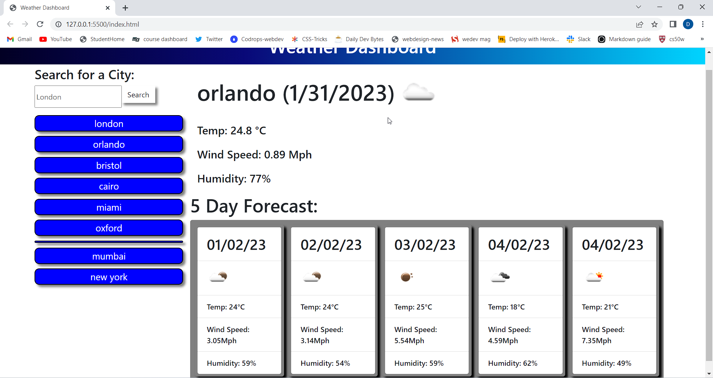

# Weather-app

## [deployment link](https://daniel-boxall.github.io/Weather-app/)

---

## User Story

```
AS A traveler
I WANT to see the weather for multiple cities
SO THAT I CAN plan a trip accordingly
```

---

## Description

This weather dashboard app displays todays weather and a 5 day forecast for any destination in the world.
To do this the software first takes an input from the user and saves the destination into local storage, then the destination is displayed as a button on the page enabling the user to have quick access to the weather data.
Once the name of the city has been saved into LocalStorage the Ajax call to openweatherAPI is made to fetch the weather data and display it to the page.

